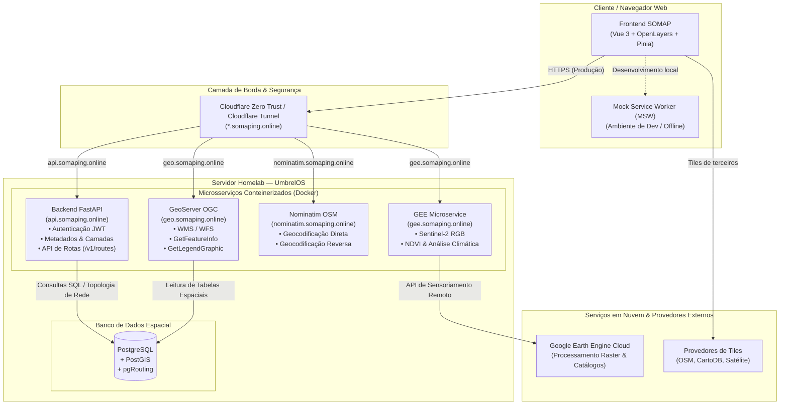

# SOMAP — Spatial Observation and MAPping

<p align="center">
  <strong>Plataforma WebGIS independente e laboratório contínuo de experimentação geoespacial</strong>
</p>

<p align="center">
  
  
  
  
  
  
  
</p>

---

## 🧭 Sobre o Projeto

O **SOMAP** é um projeto independente nascido como meu **laboratório de experimentação prática como Desenvolvedor GIS**. Seu objetivo é explorar a integração de ponta a ponta de uma stack 100% *open-source*: desde a ingestão, modelagem e disponibilização de dados espaciais no backend até a construção de interfaces WebGIS reativas, performáticas e intuitivas no navegador.

A plataforma combina o ecossistema GIS tradicional (PostGIS, GeoServer, padrões OGC) com recursos modernos de sensoriamento remoto em nuvem (Google Earth Engine), geocodificação autônoma (Nominatim) e roteirização viária em grafos (pgRouting), tudo orquestrado a partir de um servidor doméstico (**UmbrelOS**) exposto com segurança para a nuvem.

---

## 📸 Interface

### Tela de Login


### Mapa Interativo & Análises


---

## 🚀 Funcionalidades & Melhorias Recentes

### 🗺️ Visualização e Gestão de Camadas
- **Múltiplos formatos geoespaciais**: Suporte a tiles raster (`XYZ`), serviços OGC (`WMS` e `WFS`), além de vetores em `GeoJSON`.
- **Catálogo de Basemaps**: Alternância dinâmica entre mapas-base (OpenStreetMap, Imagens de Satélite MAXAR, CartoDB, etc.).
- **Controle de Camadas**: Painel lateral com ativação/desativação, ajuste contínuo de opacidade, reordenação via drag-and-drop e zoom automático na extensão da camada (*fit bounds*).
- **Workspaces Temáticos**: Organização de camadas e contextos por áreas de trabalho selecionáveis.

### 📊 Tabela de Atributos & Busca de Feições
- **Inspeção tabular interativa**: Visualização de atributos de camadas vetoriais e WFS em gaveta redimensionável e maximizável.
- **Filtragem e Busca em Tempo Real**: Filtro global textual e busca individual por colunas.
- **Interação Bidirecional Tabela-Mapa**: Destaque e centralização (*zoom to feature*) da feição no mapa ao selecioná-la na tabela.
- **Exportação de Dados**: Download instantâneo dos atributos filtrados em formato `.csv`.

### 🔍 Identificação de Feições no Mapa (Inspect)
- **GetFeatureInfo OGC**: Identificação ao clique para camadas WMS hospedadas no GeoServer com parsing de propriedades.
- **Inspeção Vetorial**: Destaque geométrico e leitura instantânea de propriedades de feições GeoJSON/WFS via popup flutuante.

### 🎨 Painel de Legenda Dinâmico
- Renderização automatizada de legendas OGC via requisição `GetLegendGraphic` do GeoServer e representação visual para camadas vetoriais estilizadas.

### 🛰️ Sensoriamento Remoto & Google Earth Engine (GEE)
- **Sentinel-2 RGB Composites**: Consulta e renderização de mosaicos dinâmicos Sentinel-2 em cores verdadeiras, permitindo filtrar intervalos temporais de interesse.
- **Análise Climática & NDVI**:
  - Geração de séries e estatísticas de NDVI (*mínimo, médio e máximo*) sobre polígonos/ROIs de interesse agrícola ou ambiental.
  - Extração de dados meteorológicos pontuais (temperatura min/médio/máx e precipitação diária/acumulada).

### 🛣️ Roteirização Topológica (pgRouting)
- Painel de rotas ponto a ponto (A ➔ B) com clique intuitivo no mapa.
- Cálculo de menor caminho sobre o grafo viário real executado via **pgRouting + PostGIS**.
- Exibição de custo total (distância em km/m e tempo estimado) e traçado destacado em azul com enquadramento automático da câmera.

### 📍 Geocodificação Direta & Reversa (Nominatim)
- **Forward Geocoding**: Busca de endereços e pontos de interesse com foco no território brasileiro e sugestões rápidas.
- **Reverse Geocoding**: Identificação automática de logradouro, bairro, município e estado ao clicar em qualquer ponto do mapa.

### 🌓 Usabilidade & Tema Escuro
- Suporte a **Dark Mode** e **Light Mode** persistente, com interface refinada baseada em Tailwind CSS e ícones contextuais.

---

## 🏗️ Arquitetura do Sistema

O ecossistema do SOMAP é composto pelo frontend estático desacoplado e um servidor doméstico autônomo baseado em **UmbrelOS**, conectado à internet através de **Cloudflare Tunnels** criptografados:



### 🔐 Integração com UmbrelOS & Cloudflare Tunnel
- **Homelab Self-Hosted (UmbrelOS)**: Todos os serviços de backend, banco de dados geográfico e servidores de mapas operam conteinerizados em um servidor doméstico dedicado.
- **Túnel Seguro sem Port-Forwarding**: A exposição dos serviços na internet é gerenciada pelo **Cloudflare Tunnel**, dispensando IP público fixo, abertura de portas no roteador residencial e provendo terminação TLS/HTTPS automática para os subdomínios do projeto (`somaping.online`).
- **Resiliência e Desenvolvimento Isolado**: Graças ao **Mock Service Worker (MSW)**, a interface pode ser desenvolvida e testada de forma 100% isolada, simulando respostas de autenticação e dados espaciais mesmo quando o servidor físico estiver em manutenção.

---

## 🛠️ Stack Tecnológica

| Camada | Tecnologias | Finalidade |
|---|---|---|
| **Frontend Core** | Vue 3 (Composition API), TypeScript, Vite | Aplicação web reativa, tipada e com build rápido |
| **Biblioteca de Mapas** | OpenLayers 10 | Renderização e manipulação do mapa, camadas, projeções e interações |
| **Gerenciamento de Estado** | Pinia | Estado compartilhado de camadas, autenticação, rotas e tabela de atributos |
| **Estilização & UI** | Tailwind CSS | Design responsivo, moderno e suporte a Dark Mode |
| **Mocks & Testes** | MSW 2 (Mock Service Worker) | Interceptação de requisições de rede para desenvolvimento offline |
| **Backend & APIs** | Python, FastAPI | APIs RESTful de autenticação, catálogo de dados e roteirização |
| **Servidor de Mapas** | GeoServer | Publicação de camadas em padrões abertos OGC (WMS, WFS) |
| **Geocodificação** | Nominatim (OpenStreetMap) | Busca e resolução de endereços e coordenadas |
| **Sensoriamento Remoto** | Google Earth Engine Python API | Computação em nuvem de índices espectrais (NDVI) e mosaicos de satélite |
| **Banco de Dados Espacial** | PostgreSQL, PostGIS, pgRouting | Armazenamento de geometrias, topologia de rede viária e consultas espaciais |
| **Hospedagem & Infra** | UmbrelOS, Docker, Cloudflare Tunnel, GitHub Pages | Homelab self-hosted, túneis seguros e deploy contínuo do frontend |

---

## ⚙️ Variáveis de Ambiente

Para configurar as conexões com as APIs locais ou de produção, crie um arquivo `.env.local` na raiz do projeto (baseando-se no `.env.production.example`):

```env
# Backend FastAPI (Rotas, Auth, Workspaces)
VITE_API_BASE_URL=https://api.somaping.online

# GeoServer (Serviços OGC WMS / WFS)
VITE_GEO_BASE_URL=https://geo.somaping.online/geoserver

# Nominatim (Geocodificação direta e reversa)
VITE_GEOCODING_API_URL=https://nominatim.somaping.online

# Google Earth Engine Microservice (NDVI, Sentinel, Clima)
VITE_GEE_API_BASE_URL=https://gee.somaping.online
VITE_GEE_API_KEY=sua-chave-aqui

# Ativar/Desativar Mocks do MSW (true para desenvolvimento offline)
VITE_USE_MOCKS=false
```

---

## 💻 Como Executar o Frontend

### Pré-requisitos
- Node.js `20.19.0+` ou `>=22.12.0`
- Gerenciador de pacotes `npm`

### Instalação

```bash
# Clone o repositório
git clone https://github.com/silasnascimento/somap.git
cd somap

# Instale as dependências
npm install
```

### Execução em Desenvolvimento

```bash
# Iniciar servidor local Vite
npm run dev
```

Por padrão, você pode definir `VITE_USE_MOCKS=true` no arquivo `.env.local` caso queira executar o frontend de forma 100% autônoma sem necessitar de conexão ativa com o servidor UmbrelOS.

### Build de Produção e Verificação de Tipos

```bash
# Checagem de tipos TypeScript + build otimizado
npm run build
```

---

## 🚀 Pipeline de Deploy

O frontend é construído e publicado continuamente no **GitHub Pages** via **GitHub Actions** a cada alteração na branch `main`. A pipeline valida os tipos TypeScript (`vue-tsc`) e gera os artefatos estáticos otimizados.

---

<p align="center">
  Desenvolvido com ☕ e paixão por Geotecnologias por <strong>Silas Nascimento</strong>
</p>
